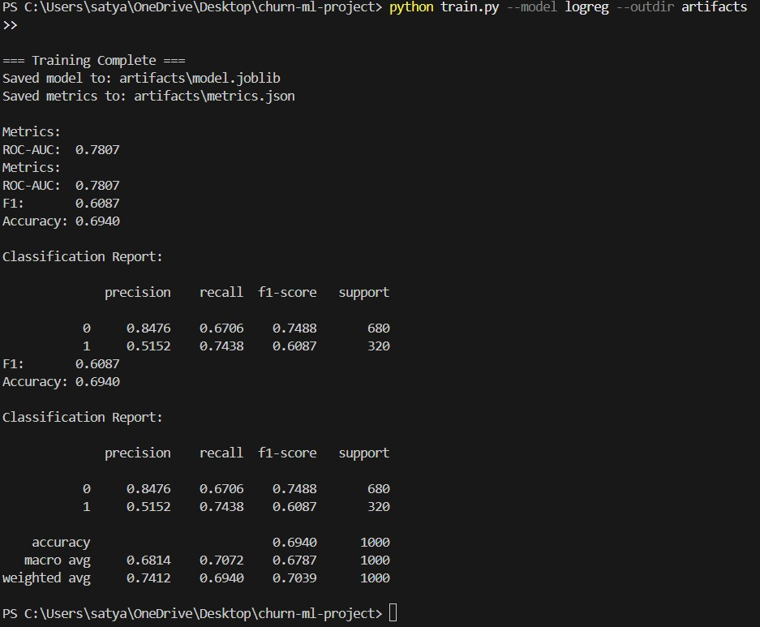
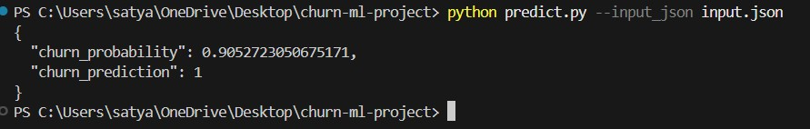

# Churn Prediction (End-to-End ML Project)

## Project Overview
This project implements an end-to-end machine learning pipeline for predicting customer churn.
It demonstrates how a classification model can be trained, evaluated, saved, and used for inference
in a production-style workflow.

## What is Churn?
Churn refers to customers stopping their use of a product or service. Predicting churn allows
businesses to identify at-risk customers early and take retention actions.

## Tech Stack
- Python
- pandas, numpy
- scikit-learn

## How It Works
1. Load customer data (synthetic or CSV)
2. Perform feature engineering and preprocessing
3. Train a classification model (Logistic Regression or Random Forest)
4. Evaluate performance using ROC-AUC, F1, and accuracy
5. Save the trained model and metrics as artifacts
6. Run predictions using JSON input via a command-line interface


## Screenshots
### Model Training & Evaluation


### Churn Prediction Output



## How to Run

### Install dependencies
```bash
pip install -r requirements.txt


